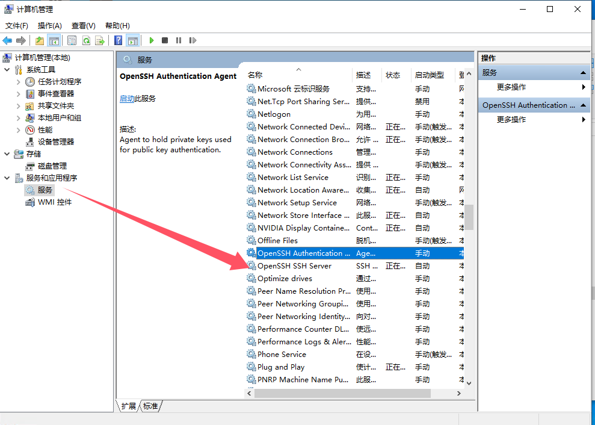
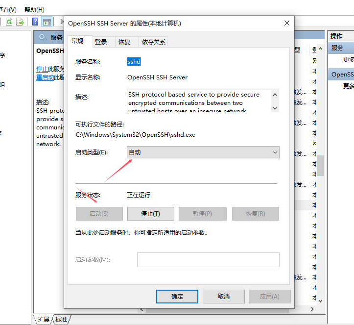
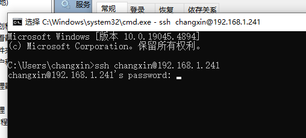
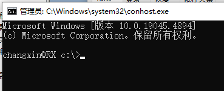

<!--
 * @Author: GM20210402
 * @Date: 2024-09-24 16:56:29
 * @LastEditors: GM20210402
 * @LastEditTime: 2024-09-24 17:40:56
-->

Windows10 版本的 OpenSSH 安装配置

## 安装

1、在设置中，搜索可选功能，进入“添加可选功能”。有些版本可以在应用中找到，但是有些版本找不到，所以建议直接搜索出来


2、在“添加可选功能”中搜索“OpenSSH”，会出现“OpenSSH 服务器”，如果有“OpenSSH 客户端”，就一并选中，并进行下一步，点击“添加”进行安装。静待安装。

# Start Generation Here


安装完成后，可在可选功能中，看见 OpenSSH 服务器和 OpenSSH 客户端。


## 配置

1、在 C:\ProgramData\ssh 目录下，有 sshd_config 文件，可以编辑该文件进行配置。目前只需要密码登录，就只有这几个配置，如果没有，就添加进文件。

```
PasswordAuthentication yes
ChallengeResponseAuthentication yes
AllowUsers 用户名
PubkeyAuthentication no
```

2、在防火墙开启端口 22 端口号(命令行窗口)
New-NetFirewallRule -Name sshd -DisplayName 'OpenSSH Server (sshd)' -Enabled True -Direction Inbound -Protocol TCP -Action Allow -LocalPort 22
注意：Windows10 以及 Windows 2008 R2 以下版本请使用以下命令(命令行窗口)
netsh advfirewall firewall add rule name=sshd dir=in action=allow protocol=TCP localport=22

3、设置 OpenSSH 服务开机自启。
在“我的电脑”右键，选择“管理”。在“服务和应用程序”的“服务”中找到“OpenSSH SSH Servier”


右键“OpenSSH SSH Servier”，选择“属性”，在“启动类型”中选择“自动”，点击“启用”，再点击“确定”。


## 使用

测试 ssh 是否可连接，在 cmd 中，输入命令行
用户名即电脑用户，密码则为开机密码（如果没有可以自己创建个新用户并设置密码。）
也可在命令提示符中键入 whoami，出现：主机\用户名。注意，主机和用户名不能相同，否则连不上！

```
ssh 用户名@主机ip
// 输入后，会继续输入密码，输入密码后，会连接到服务器
用户名@主机ip`s password:
```



连接成功显示如下


