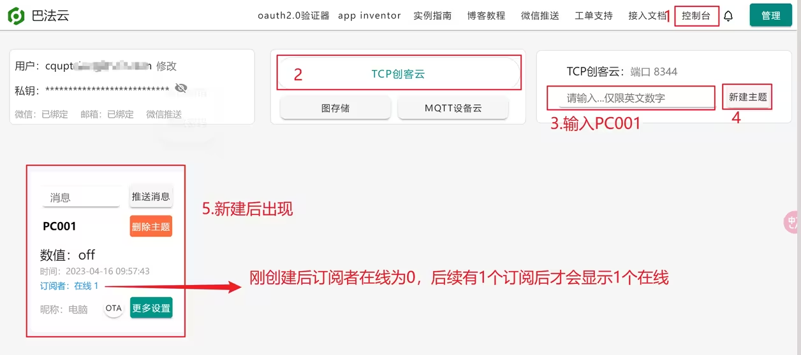
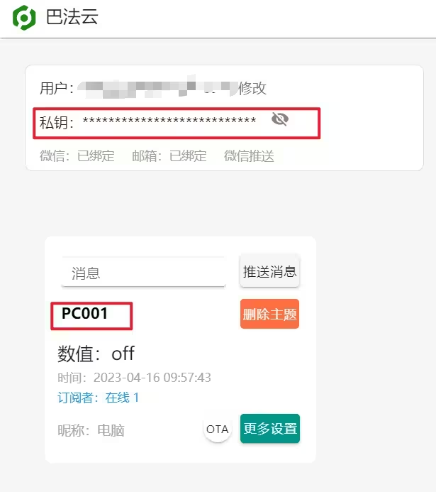
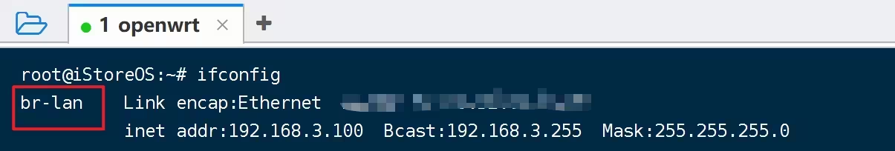
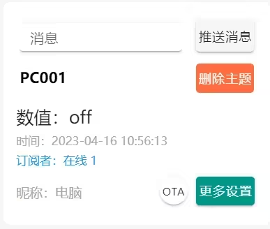
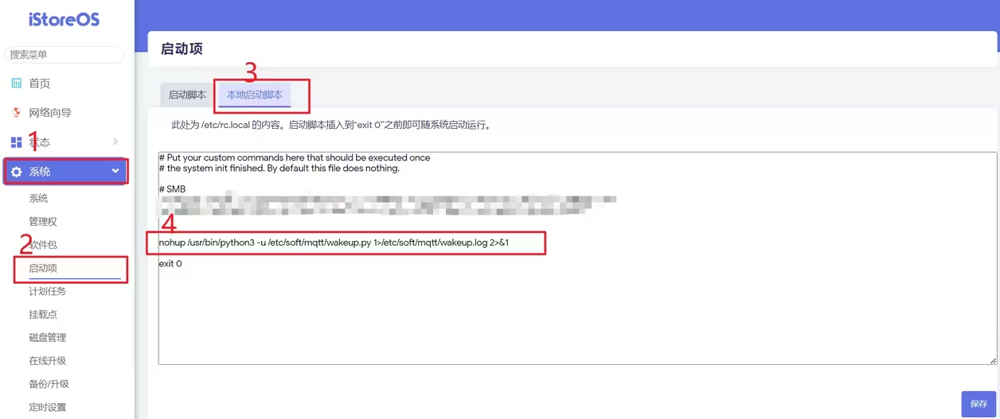
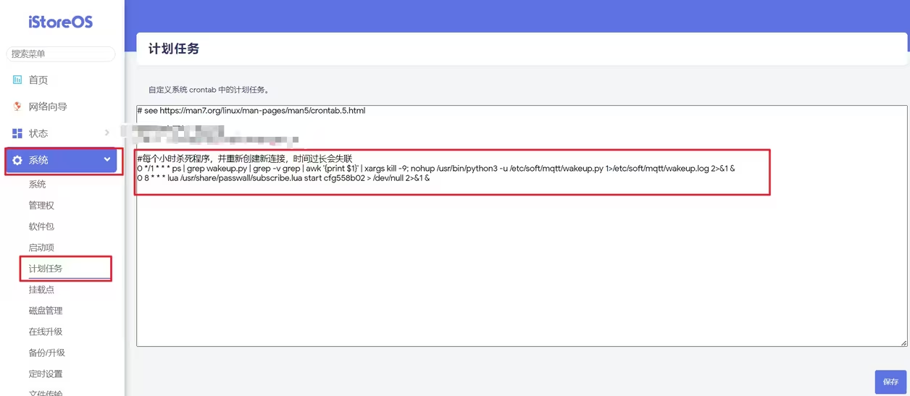

1、注册巴法云（https://cloud.bemfa.com/）

创建主题

主题名字必须为 XX001，以 001 结尾的代表是一个插座设备，后续连接小爱音箱后，对它说打开关闭，巴法云上就会收到 on/off 的数据，才能进行后续操作。

点击昵称就可以修改该主题的名字，这里直接改为电脑。



2、小爱同学相关

在米家 app 的“我的”菜单项中选择连接其它平台


找到并添加巴法


可以看到有在网页上命名的电脑设备，点击同步设备


3、Openwrt 相关

安装 etherwake（网络唤醒）、  python3（连接巴法）、sshpass（携带密码的 ssh）

```
opkg update
opkg install etherwake python3 sshpass
```

参考 https://www.cnblogs.com/bemfa/p/15435616.html ,命名为 wakeup.py，保存在任意位置，我这里保存在/etc/soft/mqtt/wakeup.py

```py
# -*- coding: utf-8
import socket
import threading
import time
import os
# 巴法云私钥
client_id = "填写自己的巴法云私钥"
# 局域网网络唤醒
# br-lan 为当前Openwrt所在的网卡
cmd1='/usr/bin/etherwake -D -i "br-lan" "需要唤醒的主机网卡MAC"'
# 主题值
topid="PC001"
# 发送关闭电脑off给巴法云，更新状态
cmd2='/usr/bin/curl -s "https://api.bemfa.com/api/device/v1/data/3/push/get/?uid=%(uid)s&topic=%(topic)s&msg=off" -w "\n"'%{"uid":client_id,"topic":topid}
# 局域网连接openssh服务器，进行关机操作
cmd3='sshpass -p 登录密码 ssh -A -g 登录账号@主机的ip地址 "shutdown -s -t 10"'

def connTCP():
    global tcp_client_socket
    # 创建socket
    tcp_client_socket = socket.socket(socket.AF_INET, socket.SOCK_STREAM)
    # IP 和端口
    server_ip = 'bemfa.com'
    server_port = 8344
    try:
        # 连接服务器
        tcp_client_socket.connect((server_ip, server_port))
        #发送订阅指令
        substr = 'cmd=1&uid='+client_id+'&topic='+topid+'\r\n'
        tcp_client_socket.send(substr.encode("utf-8"))
    except:
        time.sleep(2)
        connTCP()

#心跳
def Ping():
    # 发送心跳
    try:
        keeplive = 'ping\r\n'
        tcp_client_socket.send(keeplive.encode("utf-8"))
    except:
        time.sleep(2)
        connTCP()
    #开启定时，30秒发送一次心跳
    t = threading.Timer(30,Ping)
    t.start()


connTCP()
Ping()

while True:
	# 接收服务器发送过来的数据
	recvData = tcp_client_socket.recv(1024)
	if len(recvData) != 0:
		try:
			res = recvData.decode('utf-8')
			print('recv:', res)
			sw = str(res.split('&')[3].split('=')[1]).strip()
			print('sw',sw)
			if str(sw) == str("on"):
				try:
					print("正在打开电脑")
					os.system(cmd1)
				except:
				     print("打开电脑失败")
			else:
				try:
					print("正在关闭电脑")
					os.system(cmd2)
					os.system(cmd3)
				except:
					time.sleep(2)
		except:
			time.sleep(2)
	else:
		print("conn err")
		connTCP()
```

私钥和主题值都可以在巴法云上查看，如果不是 PC001，就根据自己的修改代码里全部的 PC001



在 openwrt 终端中输入 ifconfig，确定网卡名字，这里是 br-lan，根据自己的修改



ipconfig /all ,找到支持唤醒的网卡的物理地址，并替换代码 cmd1 里面相应数据


修改好代码后运行测试   python3 /etc/soft/mqtt/wakeup.py。如果一切正常，订阅者在线数就会变成 1



在系统-启动项-本地启动脚本中添加代码，让其开机启动，并将日志输出到 wakeup.log 中，方便排查

```po
/usr/bin/python3 -u /etc/soft/mqtt/wakeup.py 1>/etc/soft/mqtt/wakeup.log 2>&1 &
```



在系统-计划任务中添加任务，作用是每个小时，会 kill 掉 wakeup.py 的后台进程，并重新启动一个新的进程。因为经过测试，如果不这样做，时间久了，会出现虽然在巴法云的控制台上显示在线，但控制失效的情况，不知道是本地原因还是巴法那边的原因，懒得排查了

```
// 不能换行，否则kill后不会启动
0 */1 * * * ps | grep wakeup.py | grep -v grep | awk '{print $1}' | xargs kill -9;/usr/bin/python3 -u /etc/soft/mqtt/wakeup.py 1>/etc/soft/mqtt/wakeup.log 2>&1 &
```



来到系统-启动项-启动脚本，ctrl+f 搜索 cron，并点击重启，使计划任务生效


重启 openwrt，或者直接执行一次，openwrt 相关操作完成

```
/usr/bin/python3 -u /etc/soft/mqtt/wakeup.py 1>/etc/soft/mqtt/wakeup.log 2>&1 &
```

问题：
